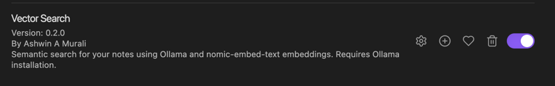

# Nexus MCP

<div style="display: flex; align-items: flex-start; margin-bottom: 20px;">
  <div style="flex: 0 0 800px; margin-right: 20px;">
    
  </div>
  <div style="flex: 1;">
    A powerful personal assistant MCP server that integrates with various services including Google Calendar, Obsidian Vault, Trello, and web page parsing capabilities. Built using FastMCP, this server provides a unified interface for managing your digital life.

## Features

- **Google Calendar Integration**
  - Create, read, update, and delete calendar events
  - List upcoming events

- **Obsidian Vault Management**
  - Create, read, update, and delete notes
  - Full-text search in notes
  - Folder management (create, delete, search, list)

- **Trello Integration**
  - Board, list, and card management
  - Create, update, and delete cards
  - Search cards by text query

- **Web Page Parsing**
  - Extract and clean HTML content from any URL

- **Google News Search**
  - Search for recent news articles on a given topic
  </div>
</div>

## Prerequisites

- Python 3.10 or higher
- Poetry (Python package manager)
- Google Calendar API credentials
- Trello API credentials (if using Trello features)
- Obsidian Vault (if using Obsidian features)

## Installation

1. Clone the repository:
   ```bash
   git clone https://github.com/yourusername/personal-assistant-mcp.git
   cd personal-assistant-mcp
   ```

2. Install dependencies using Poetry:
   ```bash
   poetry install
   ```

3. Set up Google Calendar API:
   - Go to the [Google Cloud Console](https://console.cloud.google.com/)
   - Create a new project or select an existing one
   - Enable the Google Calendar API
   - Create OAuth 2.0 credentials
   - Download the credentials and save them as `credentials.json` in the project root

4. Set up Trello API (optional):
   - Go to [Trello Developer Portal](https://trello.com/app-key)
   - Get your API key and token
   - Add them to your environment variables or config file

## Configuration

1. Run the initial setup to authenticate with Google Calendar:
   ```bash
   poetry run python main.py
   ```
   - This will open a browser window for Google authentication
   - Follow the prompts to authorize the application

## Usage

1. Start the server:
   ```bash
   poetry run python main.py
   ```

2. The server will start and be ready to accept MCP-compatible client connections.

3. Use any MCP-compatible client to interact with the server. The server provides the following tools:
   - Calendar management
   - Obsidian vault operations
   - Trello board management
   - Web page parsing

## Anthropic Claude Desktop Configuration

To use this server with Anthropic Claude Desktop, add the following configuration to your Claude Desktop settings:

```json
{
   "mcpServers": {
      "personal-assistant": {
         "command": "/path/to/your/venv/bin/python",
         "args": ["/path/to/your/project/main.py"],
         "env": {
                 "GOOGLE_CREDENTIALS_PATH": "/path/to/your/credentials.json",
                 "GOOGLE_TOKEN_PATH": "/path/to/your/token.json",
                 "GOOGLE_API_KEY": "your_google_api_key",
                 "GOOGLE_CX_ID": "your_google_cx_id",
                 "OBSIDIAN_VAULT_PATH": "/path/to/your/obsidian/vault",
                 "OBSIDIAN_DEFAULT_FOLDER": "your_default_folder",
                 "TRELLO_API_KEY": "your_trello_api_key",
                 "TRELLO_TOKEN": "your_trello_token",
                 "LOG_PATH": "/path/to/log.txt",
                 "ENABLE_OBSIDIAN_TOOLS": "True/False",
                 "ENABLE_TRELLO_TOOLS": "True/False",
                 "ENABLE_CALENDAR_TOOLS": "True/False",
                 "ENABLE_NEWS_SEARCH": "True/False",
                 "ENABLE_WEB_PARSER": "True/False",
                 "SEMANTIC_SEARCH_ENABLED": "True/False",
                 "EMBEDDINGS_PATH": "/path/to/embeddings.json"
         }
      }
   }
}
```

Replace the paths and credentials with your actual values:
- `command`: Path to your Python virtual environment's Python executable
- `args`: Path to your project's `main.py` file
- `ENABLE_OBSIDIAN_TOOLS`: Set to `True` to enable Obsidian tools
- `ENABLE_TRELLO_TOOLS`: Set to `True` to enable Trello tools
- `ENABLE_CALENDAR_TOOLS`: Set to `True` to enable Google Calendar tools
- `ENABLE_NEWS_SEARCH`: Set to `True` to enable Google News search
- `ENABLE_WEB_PARSER`: Set to `True` to enable the web parser tool
- `GOOGLE_CREDENTIALS_PATH`: Path to your Google Calendar credentials file (`credentials.json`)
- `GOOGLE_TOKEN_PATH`: Path to your Google Calendar token file (`token.json`)
- `GOOGLE_API_KEY`: Your Google API Key (for Custom Search API)
- `GOOGLE_CX_ID`: Your Google Programmable Search Engine ID (CX ID for Custom Search API)
- `OBSIDIAN_VAULT_PATH`: Path to your Obsidian vault
- `OBSIDIAN_DEFAULT_FOLDER`: Optional path to default folder in your vault where new notes will be created
- `TRELLO_API_KEY`: Your Trello API key
- `TRELLO_TOKEN`: Your Trello API token
- `LOG_PATH`: Path to the log file
- `SEMANTIC_SEARCH_ENABLED`: Set to `True` to enable semantic search for Obsidian Vault
- `EMBEDDINGS_PATH`: Optional path to the embeddings json file generated by the Obsidian Vector Search plugin (defaults to `.obsidian/plugins/vector-search/data.json` relative to `OBSIDIAN_VAULT_PATH` if not set)

To enable semantic search capabilities, you'll need to install the [Vector Search plugin](https://github.com/rndmzl/obsidian-vector-search) for Obsidian.



After the reindexing process is complete, the plugin will generate a JSON file containing vector embeddings at the following location:

```.obsidian/plugins/vector-search/data.json```

This file will be used as the embedding source for semantic search queries.

## Development

- The project uses Poetry for dependency management
- All tools are registered in `main.py`
- Service-specific implementations are in the `services/` directory
- Follow PEP 8 style guidelines for Python code

## Contributing

1. Fork the repository
2. Create your feature branch (`git checkout -b feature/amazing-feature`)
3. Commit your changes (`git commit -m 'Add some amazing feature'`)
4. Push to the branch (`git push origin feature/amazing-feature`)
5. Open a Pull Request

Join:

[Telegram](https://t.me/systemlog_ai)
[Blog](https://neuromant.wordpress.com/)
